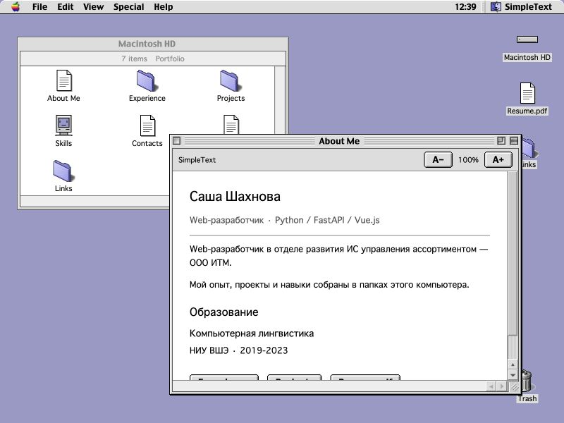

# Vue Mac OS 9 migration

## Existing-project audit

- Framework: Vue `^3.5.22`, resolved to 3.5.22 in the existing lockfile.
- Bundler: Vite `^7.1.7` (lockfile 7.1.12), `@vitejs/plugin-vue ^6.0.1`. No Webpack.
- Router: none. The previous application used an `openWindow` string; opening a second item replaced the first window.
- Public path: `/web_cv/` in `vite.config.js`. Previously, root-relative icon/font/wallpaper paths bypassed that base.
- Global CSS: Vite starter dark-mode styles, rounded generic buttons, max-width 1280px, and conflicting font families.
- Entry: `src/main.js` imports the global stylesheet and mounts `App.vue`.
- CV data: a nested `resumeData` object in `DocumentViewer.vue`, containing contact details, five projects, two jobs, eleven skills, and education. The full object now lives in `src/data/cv.js`.
- Useful components/assets: desktop selection/dragging intent, document/PDF access, local Geneva and Charcoal fonts, Apple/Finder/Trash graphics, original PDF. The overlapping `Window`, `VintageWindow`, and `WindowNew` implementations required replacement.
- Retained dependencies: Vue, Vite, Vue Vite plugin, and `gh-pages` for the existing manual deployment command.
- Removed dependencies: none were necessary. No React, Next.js, router package, UI library, emulator, or server dependency was added.
- Deployment: existing `npm run deploy` used `gh-pages -d dist`; no GitHub Actions deployment existed. `.github/workflows/pages.yml` now tests/builds/validates and deploys the static artifact from `master`.

## Reference inspection

Inspected the local `mihaip/infinite-mac` checkout at commit
`f77ee43c24baa804ee9bd7a6d024f1b34aa6244a`, particularly:

- `src/controls/Appearance.css`
- `src/controls/Button.css`
- `src/controls/BevelButton.css`
- `src/controls/Dialog.css` and `Dialog.tsx`
- `src/controls/Input.css` and `Select.css`
- `src/Images/Platinum*.png` and `src/Fonts/Charcoal.woff2`
- `src/emulator/common/finder.ts` and `src/defs/run-def.ts`

The actual Finder, menu bar, desktop, windows, and scrollbars are rendered by
Mac OS inside an emulator canvas. Infinite Mac does **not** have DOM/React
Finder-window components or CSS for that desktop. Their geometry, icon
selection, window activation, menu appearance, disabled commands, scroll-arrow
placement, and title-bar controls were inspected in the running Mac OS 9.0.4
benchmark with an explicit 800×600 guest screen.

The benchmark website and local reference checkout are development references
only. The portfolio has no runtime dependency on either, and contains no ROMs,
emulator, imported React architecture, or remote Infinite Mac iframe.

## Component comparison and Vue mapping

| Element | Inspected reference detail | Local implementation |
| --- | --- | --- |
| Menu bar | 20px height, Charcoal, gray surface, black baseline, rounded upper desktop corners | `MenuBar.vue`, local Charcoal, single-pixel CSS edges |
| Desktop | Lavender field, disk at upper right and Trash at lower right | `App.vue`, local pattern preferences and viewport-clamped icon positions |
| Windows | Crisp gray bevel frame, thin black active outline, muted inactive frame | `MacWindow.vue`, shared focus/stack state; no soft modern shadows |
| Title bars | Striped active bar, unstriped inactive bar, centered Charcoal title | Local repeating pixel-stripe CSS; active state driven by Vue |
| Window buttons | 13px close/zoom/collapse controls, controls disappear when inactive | Small local samples from the rendered benchmark; actual close/zoom/restore/window-shade behavior |
| Finder | Thin status strip, white content, 32px icons, icon/list layouts | `FinderWindow.vue`, reactive directory contents and sorting |
| Dialogs | Platinum 5px sliced raster border, 18px padding, checkerboard backdrop | Direct local `PlatinumDialogFrame.png`, translated Vue dialog with focus containment and Enter/Escape |
| Buttons | 4px raster slices; separate pressed asset, 13px line height | Adapted Infinite Mac CSS with local `PlatinumButton` and active counterpart |
| Scrollbars | 16px gutter, pixel bevel thumb, both arrows at bottom/right | `ScrollArea.vue`; arrows/repeat, track paging, thumb dragging, native wheel/touch scroll, keyboard control |
| Desktop icons | 32px graphics, small labels, black selected labels, darker selected icons | `DesktopIcon.vue`; local Finder-folder sample, existing Apple/Finder/Trash assets, CV document/alias icons |
| Menus | Gray popup, black 1px border/shadow, blue selection, separators, disabled items, submenus | Reactive Vue menus with hover switching, press-drag-release and keyboard navigation |
| Typography | Charcoal for system chrome; small Geneva-style content text | Reference Charcoal WOFF2 and existing Geneva TTF; browser fallback supports Cyrillic |
| Borders/shadows | Pixel bevels and offset single-pixel shadows | Border-image for supplied Platinum controls; explicit pixel edges elsewhere |
| Focus | Front window controls/title are active, other titles/scrollbars muted | One shared `activeId`; ordered window array defines z-index and application switcher |
| Selection/cursors | Desktop icon selection, rectangular marquee, ordinary arrow pointer | Vue selection model, Shift/Command/Ctrl selection, marquee; diagonal cursor on resize grip |

The folder/control samples are local crops of the browser-rendered benchmark;
the browser capture is JPEG, so these are **not lossless original OS resources**.
The supplied Infinite Mac Platinum border assets are copied directly.
CV-specific document, disk, computer, and alias SVGs are local adaptations.
The content, folder organization, responsive layout, PDF browser viewer, and
accessibility support are portfolio-specific. This is a web desktop, not an
emulation of the operating system or a claim of pixel-identical OS behavior.

Reference: [captured Infinite Mac](screenshots/infinite-mac-reference.jpg).
Final browser evidence:



## Interactions and state

- `useDesktop.js`: files, focus, stacking, opening/closing, window shade/zoom state,
  folder creation, recoverable session Trash, restoration, recursive emptying.
- `usePointer.js`: pointer capture and listener teardown shared by dragging,
  resizing, icon movement, marquee selection, and scrollbar thumbs.
- `geometry.js`: viewport constraints and resize bounds, covered by Node tests.
- Window/body state is independent for each open item. Opening an existing item
  brings its window forward instead of creating a duplicate.
- Wallpaper and desktop icon positions persist in optional localStorage.
- Custom folders and open windows are session state. Fixed portfolio items cannot
  be deleted. Custom folders can be moved to Trash and restored through Put Away.
- Hash URLs such as `#about`, `#projects`, `#contacts`, and `#resume` reopen the
  corresponding content on refresh without server fallback routing.
- Unsupported/malformed hashes fall back to Macintosh HD.
- PDF rendering uses the browser's PDF viewer with local download/open links.
  Its internal viewer chrome depends on the browser.
- No upload feature existed in the original portfolio; none is required for the
  CV. No uploads, cloud storage, or backend were introduced.

## Validation

The startup screen uses the original logo panel from the user-supplied Mac OS 9
screenshot, with geometry compared against the running Infinite Mac benchmark.
Static HTML displays the splash before Vue starts. The progress bar tracks the
application import, local fonts, and desktop images; cached loads retain a
two-second presentation. Reduced-motion users skip this extra delay. Failed
optional images/fonts time out without blocking the CV, and application import
errors display a Reload button. Each refresh shows the splash and preserves
hash navigation. All startup assets are local.

Production-preview checks confirmed startup, automatic transition to Projects
via `#projects`, repeat refresh, and a 375×667 viewport with no console errors.
Screenshots: [desktop startup](screenshots/startup-screen.jpg) and
[mobile startup](screenshots/startup-mobile.jpg).

Run from `windows-project`:

```sh
npm ci
npm test
npm run build
npm run check:build
npm run preview
```

Tests cover viewport bounds, CV record preservation, independent windows,
focus/stacking, duplicate opening, zoom restoration, protected portfolio files,
and nested Trash removal/restoration. The static build validator checks asset
paths and local runtime files, base prefix, and absence of remote Infinite Mac,
localhost, React, or Next runtime dependencies.

Browser validation performed against the production preview under `/web_cv/`:
opening documents, active/inactive windows, actual pointer drag/resize,
collapse/expand, zoom/restore, arrow scrolling, keyboard menus/submenus,
new-folder dialog, move-to-Trash/Put Away, local image loading, hash refresh,
and a 375×667 viewport. Small-screen popup clipping found during testing was
corrected by constraining popup placement.

Additional final checks: builds and static-asset validation passed for both `/web_cv/` and `/portfolio-test/`. The production build was restored to `/web_cv/`. Browser console diagnostics were empty during the final interaction run.
